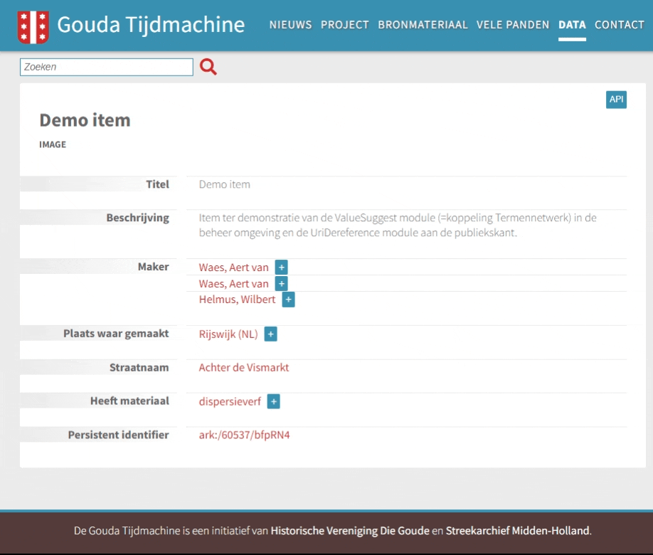

# URI Dereferencer

Dereferences URIs when viewing items, media, and item sets.

## Dereferenceable URIs

Dereferenceable URIs are the backbone of [Linked Data](https://en.wikipedia.org/wiki/Linked_data).
They can be looked up (dereferenced) to provide useful information about the resource
that the URI identifies, which in turn refers to other URIs, and so on.

This module looks up URIs on the page and provides users a snapshot of linked data
without having to navigate away from the page. It will automatically dereference
all "URI" data type values that match a registered service. If you want your custom
data type values to be dereferenceable, you must add the `uri-value-link` class
to the anchor tag containing the URI.

## Demonstration

[](https://n2t.net/ark:/60537/bfpRN4)

## Linked data services

Linked data services are JavaScript objects that are responsible for dereferencing
URIs and returning information about the resource. This module already comes with
a handful of services:

- [DBpedia](https://wiki.dbpedia.org/)
- [Geonames](https://www.geonames.org/)
- [Getty Vocabularies](https://www.getty.edu/research/tools/vocabularies/)
- [LC Linked Data Service](http://id.loc.gov/)
- [OCLC VIAF](https://www.oclc.org/en/viaf.html)
- [OCLC FAST](http://fast.oclc.org/)
- [RDA Value Vocabularies](http://www.rdaregistry.info/termList/)
- [Wikidata](https://www.wikidata.org/wiki/Wikidata:Main_Page)
- [Gemeentegeschiedenis](https://www.gemeentegeschiedenis.nl/)

You can create your own linked data service objects by writing them against the
following interface and adding them to the global `UriDereferencer` object.

### Service interface

```js
{
    /**
     * Get the name of this service.
     *
     * @return {string}
     */
    getName() {},
    /**
     * Get options for this service.
     *
     * @return {object}
     */
    getOptions() {},
    /**
     * Does this service recognize the URI?
     *
     * @param {string} uri The URI
     * @return {bool}
     */
    isMatch(uri) {},
    /**
     * Get the resource URL of a URI.
     *
     * The resource URL typically dereferences to an RDF file (JSON-LD, XML,
     * etc.) that represents the URI. Note that the service must have cross-
     * origin resource sharing (CORS) enabled.
     *
     * @param {string} uri The URI
     * @return {string}
     */
    getResourceUrl(uri) {},
    /**
     * Get information about the resource in HTML markup.
     *
     * @param {string} uri The URI
     * @param {string} text The response text of the resource
     * @return {string}
     */
    getMarkup(uri, text) {}
}
```

### Service options

Services can modify their options if they require special handling.

- `useProxy: {bool}`: (default `false`) Use the local proxy server if configured? This
is useful if the linked data service doesn't allow cross-origin HTTP requests (CORS).
Note that the global `UriDereferencer` object must have set a valid `proxyUrl`.

### Service implementation example

```js
UriDereferencer.addService({
    getName() {
        return 'My Linked Data Service';
    },
    getOptions() {
        // This example assumes this service requires a proxy server
        return {useProxy: true};
    }
    isMatch(uri) {
        return (null !== this.getMatch(uri));
    },
    getResourceUrl(uri) {
        // This example assumes a JSON-LD resource. There are many possible
        // ways to dereference a URL, depending on the service (e.g. RDF/XML,
        // SPARQL endpoint).
        const match = this.getMatch(uri);
        return `http://example.com/vocab/${match[1]}.jsonld`;
    },
    getMarkup(uri, text) {
        // This example assumes JSON response text. You may need to parse the
        // response text differently (e.g. XPath for XML).
        const json = JSON.parse(text);
        return `
        <dl>
            <dt>Label</dt>
            <dd>${json['label']}</dd>
            <dt>Description</dt>
            <dd>${json['description']}</dd>
        </dl>`;
    },
    // Get the URI match (not part of the interface, but useful anyway).
    getMatch(uri) {
        return uri.match(/^https?:\/\/example\.com\/vocab\/(.+)$/);
    }
});
```

# Copyright

URIDereferencer is Copyright © 2019-present Corporation for Digital Scholarship, Vienna, Virginia, USA http://digitalscholar.org

The Corporation for Digital Scholarship distributes the Omeka source code
under the GNU General Public License, version 3 (GPLv3). The full text
of this license is given in the license file.

The Omeka name is a registered trademark of the Corporation for Digital Scholarship.

Third-party copyright in this distribution is noted where applicable.

All rights not expressly granted are reserved.

